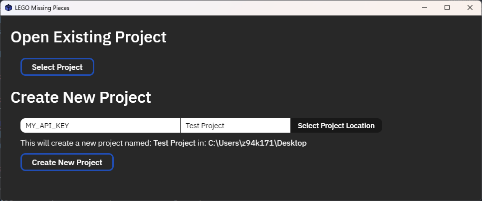
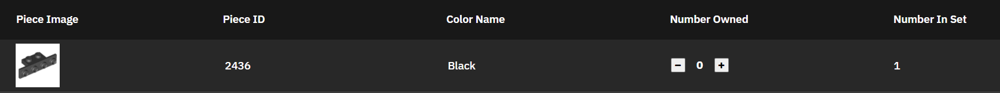
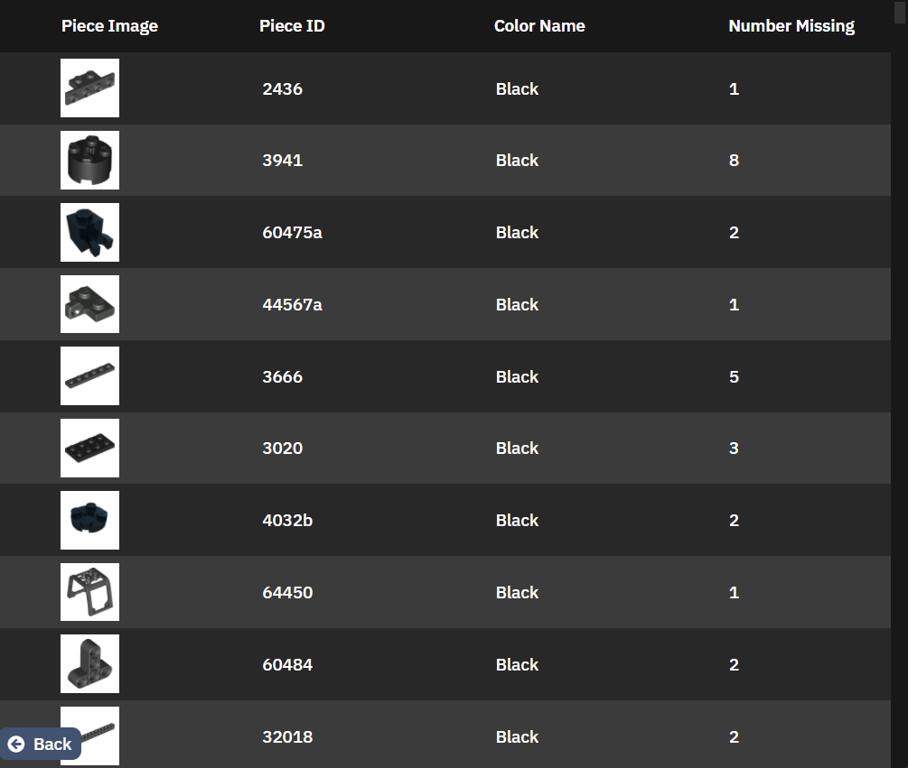

# LegoMissingPieces
Electron app to keep track of missing pieces from LEGO Sets

## Installation
Download the [lasest release](https://github.com/CodeAX2/LegoMissingPieces/releases) and unzip it into desired location.

Run the LEGO Missing Pieces program in the unzipped folder.

## Usage

### Creating a New Project
To create a new project, you will need an API key from [Rebrickable](https://rebrickable.com/).\
Next, define a name for the project and select a directory for it to be located in.\
Click the "Create New Project" button and it will be automatically created.

### Opening an Existing Project
To open an existing project, click the "Select Project" button and navigate to the location of the project. \
All projects are saved in a .json format.

### Adding Sets
To add a new set to an open project, click the "Add Set" button along the top of the screen.\
Enter either the desired set's name or theme ID into the search bar and click the "Go" button. Numerous search results should appear.\
Click on the "Add Set" button next to the desired set.

### Editing Missing Pieces
Select a set by clicking on its image within the list on the left pane of the screen. This will open its detailed view in the right pane of the screen.\
Click the "Edit Missing Pieces" button.\
A list of all the pieces in the set should appear. This list includes an image for each piece, along with color, piece ID, etc.\
Click the "-" and "+" buttons to change the amount you own. 

### Viewing All Missing Pieces
Once you have set the missing pieces for each set in your project, click the "View All Missing Pieces Button".\
This opens a list detailing how many of each individual piece are missing in total across all sets. Included are other fields similar to before.

### Removing a Set From a Project
To remove a set, select it by clicking its image within the list on the left pane.\
Click the "Remove Set" button.\
A dialog should appear asking you to confirm your decision to remove the set. To proceed with removing the set, click "Remove Set" within this dialog.

### Saving a Project
Projects are automatically saved whenever:
- You finish editing pieces for a set
- You add a new set
- You change to a different project
- You close out of the program
